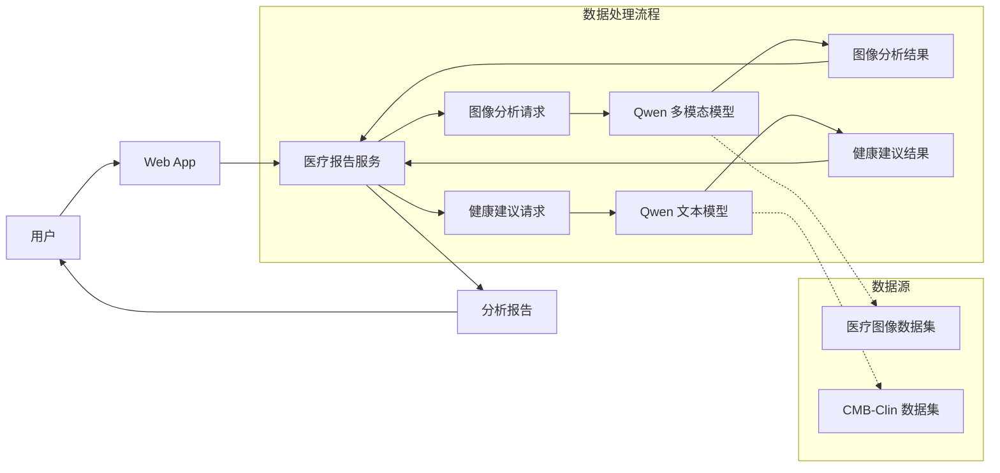
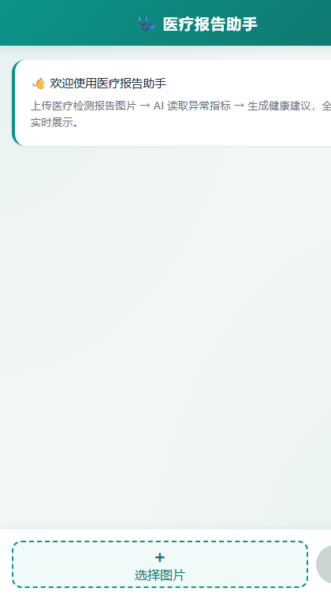
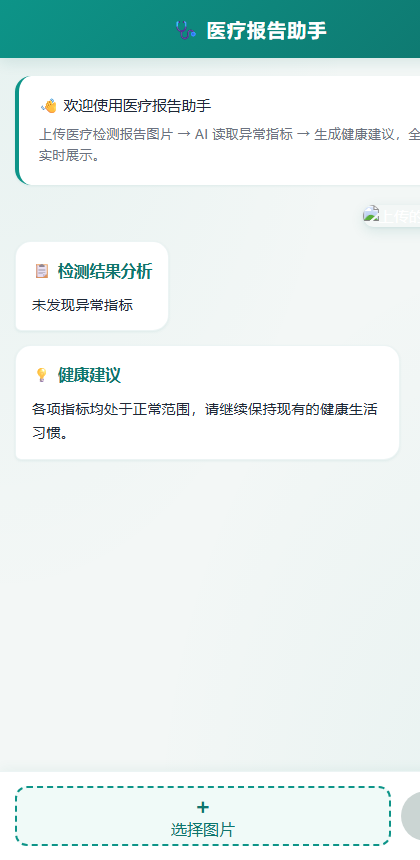

# LLM 微调实战项目：私人健康管家

## 项目概述

本项目是 LLM 微调课程的实战课程，选用 Qwen3.5-4B 作为基座模型，通过 LoRA 训练医学问答模型和医学报告图像理解模型，最终实现解读医学检测报告并提供专业的健康建议。



## 效果预览

| 界面首页 | 完整分析效果 |
| --- | --- |
|  |  |

> 上传报告图片后全流程流式输出：思考过程实时滚动 → 异常指标结论 → 分段健康建议。


## 技术栈

- **基座模型**: Qwen3.5-4B
- **微调框架**: Unsloth
- **推理引擎**: vLLM
- **服务框架**: FastAPI
- **评估工具**: EvalScope
- **前端**: 原生 HTML/CSS/JavaScript


## 项目地图（模块结构）

> 已按「数据 → 训练 → 评估 → 部署」生命周期重组，去掉 day1/day2 按天划分。
> v4 为唯一主服务，v1–v3 与 prototype-images 归档至 `deploy/api/_archive/`。

```
MedButler/
├── README.md
├── .env.example                   # 云端训练/评估环境变量模板（HF 镜像、GPU 等）
├── requirements/                  # 分模块 pip 依赖（版本对齐各 uv.lock）
│   ├── api-v4.txt                 # v4 主服务（Windows 本地可装）
│   ├── train.txt                  # 微调训练（云端）
│   ├── eval-llm.txt               # LLM 评估（云端）
│   └── vllm-service.txt           # vLLM 推理服务（云端）
├── data/                          # 数据准备与存储
│   ├── raw/                       # 原始下载数据（cMedQA2：question/answer 的 zip+csv）
│   ├── prepare/                   # 处理脚本 + 生成的数据集（med-dataset*.jsonl/json）
│   └── images/                    # 数据集图像
│       ├── train/                 # VL 训练图像
│       ├── test/                  # 测试图像
│       └── test-vl/               # VL 验证图像
├── train/                         # 微调训练
│   ├── llm/                       # LLM 微调（Unsloth + LoRA）
│   └── vl/                        # VL 多模态微调
│       └── vllm-validation/       # 训练后用 vLLM 快速验证 VL 效果
├── eval/                          # 评估
│   └── llm/                       # LLM 评估
│       ├── evalscope/             # EvalScope 评测脚本（原 1-eval）
│       ├── vllm-service/          # 评估时拉起的 vLLM 服务（原 2-vllm）
│       └── result-viewer/         # 评估结果可视化查看（原 3-app）
└── deploy/                        # 部署与服务
    ├── convert/                   # 云端 GGUF / 格式转换脚本
    ├── launch-vllm/               # 云端正式 vLLM 部署脚本
    ├── validation/                # 部署前模型验证（含 test-img 测试图）
    └── api/
        ├── v4/                    # ★ 主服务：流式 Web UI（FastAPI + 原生前端）
        │   ├── fastapi_v4_ui.py   #    服务入口
        │   ├── config.py          #    运行配置（读同目录 .env，默认值兜底）
        │   ├── .env.example       #    配置模板（复制为 .env 生效，不入库）
        │   ├── logger.py          #    全链路日志（logs/ 按天滚动）
        │   └── ui/                #    前端三件套
        └── _archive/              # 历史版本归档（v1/v2/v3/prototype-images）
```

### 各模块职责速查

| 模块 | 职责 | 入口 |
| --- | --- | --- |
| `data/raw` | 原始下载数据（cMedQA2），只读不改 | — |
| `data/prepare` | 数据清洗、合并、划分、转 EvalScope 格式 | `1-prepare-dataset.sh` 起按序号执行 |
| `data/images` | VL 训练/测试/验证图像 | — |
| `train/llm` | Qwen3.5-4B 文本微调（LoRA） | Unsloth 训练脚本 |
| `train/vl` | Qwen3.5-4B-VL 多模态微调 | `train/vl/1-run-train.sh` |
| `train/vl/vllm-validation` | 训练后用 vLLM 快速验证 VL 效果 | `2-launch-vllm-for-validation.sh` |
| `eval/llm/evalscope` | 微调前后 LLM 对比评测 | `3-eval-original-qwen.sh` / `5-eval-finetuned-qwen.sh` |
| `eval/llm/vllm-service` | 评估时拉起原版/微调版 vLLM 服务 | `2-launch-orginal-qwen.sh` / `4-launch-finetuned-qwen.sh` |
| `eval/llm/result-viewer` | EvalScope 结果可视化 | `7-check-eval-result.sh` |
| `deploy/convert` | 模型转 GGUF 等格式 | 转换脚本 |
| `deploy/launch-vllm` | 正式环境 vLLM 部署 | 启动脚本 |
| `deploy/validation` | 部署前模型验证与测试图 | 验证脚本 |
| `deploy/api/v4` | 线上主服务（流式报告解读 + Web UI） | `fastapi_v4_ui.py` |

## 核心功能

### 1. 医学报告图像分析 (VL 模型)

输入医学检测报告图像，自动识别异常指标：

```
输入: 医学检测报告图片
    │
    ▼
VL 模型分析图像
    │
    ▼
输出: "检测到以下异常指标：..." 
```

### 2. 健康问答 (LLM 模型)

基于医学知识库回答健康相关问题：

```
输入: "我肚子疼是怎么回事？"
    │
    ▼
LLM 健康顾问
    │
    ▼
输出: "根据您描述的症状，可能的原因包括..."
```

### 3. 完整分析流程

结合 VL 和 LLM 模型，提供完整的健康分析服务：

1. 用户上传医学报告图片
2. VL 模型识别异常指标
3. LLM 基于异常指标生成健康建议
4. 返回完整的分析报告


## 注意事项

- 本项目为编程学习练习，输出内容仅为演示API调用流程，不具备任何医学参考价值
- 模型输出可能存在错误、偏差或完全不相关的内容，切勿根据模型输出做出任何实际健康判断或决策

