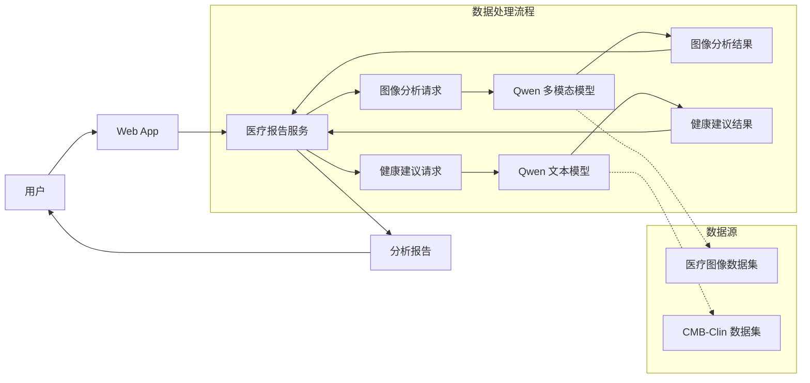

# LLM 微调实战项目：私人健康管家

## 项目概述

本项目是 LLM 微调课程的实战课程，选用 Qwen3.5-4B 作为基座模型，通过 LoRA 训练医学问答模型和医学报告图像理解模型，最终实现解读医学检测报告并提供专业的健康建议。




## 技术栈

- **基座模型**: Qwen3.5-4B
- **微调框架**: Unsloth
- **推理引擎**: vLLM
- **服务框架**: FastAPI
- **评估工具**: EvalScope
- **前端**: 原生 HTML/CSS/JavaScript


## 项目地图（模块结构）

> 已按「数据 → 训练 → 评估 → 部署」生命周期重组，去掉 day1/day2 按天划分。
> v4 为唯一主服务，v1–v3 与 prototype-images 归档至 `deploy/api/_archive/`。

```
MedButler/
├── README.md
├── data/                          # 数据准备与存储
│   ├── prepare/                   # 数据集处理脚本（prepare_dataset / split / evalscope 转换）
│   └── images/                    # 数据集图像
│       ├── train/                 # 训练图像
│       ├── test/                  # 测试图像
│       └── test-vl/               # VL 验证图像
├── train/                         # 微调训练
│   ├── llm/                       # LLM 微调（Unsloth + LoRA）
│   └── vl/                        # VL 多模态微调（含 vllm-validation/ 验证）
├── eval/                          # 评估
│   └── llm/                       # LLM 评估（EvalScope）
└── deploy/                        # 部署与服务
    ├── convert/                   # GGUF / 格式转换脚本
    ├── launch-vllm/               # vLLM 服务启动脚本
    ├── validation/                # 模型验证（含 test-img 测试图）
    ├── api/
    │   ├── v4/                    # ★ 主服务：完整 Web UI（FastAPI + 原生前端）
    │   └── _archive/              # 历史版本归档
    │       ├── v1/                #   基础文件上传版本
    │       ├── v2/                #   Base64 图像传输版本
    │       ├── v3/                #   vLLM 集成版本
    │       └── prototype-images/  #   原型设计截图
    └── (data 模块另有 images 数据集，见上)
```

### 各模块职责速查

| 模块 | 职责 | 入口 |
| --- | --- | --- |
| `data/prepare` | 原始数据集清洗、划分、转 EvalScope 格式 | `prepare_dataset.py` / `split_dataset.py` |
| `data/images` | 训练/测试/VL 验证图像存放 | — |
| `train/llm` | Qwen3.5-4B 文本微调（LoRA） | Unsloth 训练脚本 |
| `train/vl` | Qwen3.5-4B-VL 多模态微调 | VL 训练脚本 |
| `eval/llm` | 微调后 LLM 评估 | EvalScope |
| `deploy/convert` | 模型转 GGUF 等格式 | 转换脚本 |
| `deploy/launch-vllm` | 启动 vLLM 推理服务 | 启动脚本 |
| `deploy/validation` | 模型验证与测试图 | 验证脚本 |
| `deploy/api/v4` | 线上主服务（报告解读 + Web UI） | `fastapi_v4_ui.py` |

## 核心功能

### 1. 医学报告图像分析 (VL 模型)

输入医学检测报告图像，自动识别异常指标：

```
输入: 医学检测报告图片
    │
    ▼
VL 模型分析图像
    │
    ▼
输出: "检测到以下异常指标：..." 
```

### 2. 健康问答 (LLM 模型)

基于医学知识库回答健康相关问题：

```
输入: "我肚子疼是怎么回事？"
    │
    ▼
LLM 健康顾问
    │
    ▼
输出: "根据您描述的症状，可能的原因包括..."
```

### 3. 完整分析流程

结合 VL 和 LLM 模型，提供完整的健康分析服务：

1. 用户上传医学报告图片
2. VL 模型识别异常指标
3. LLM 基于异常指标生成健康建议
4. 返回完整的分析报告


## 注意事项

- 本项目为编程学习练习，输出内容仅为演示API调用流程，不具备任何医学参考价值
- 模型输出可能存在错误、偏差或完全不相关的内容，切勿根据模型输出做出任何实际健康判断或决策

